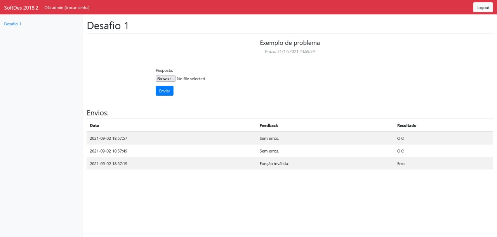

# Servidor de desafios
 

## Sobre
Este servidor hospeda um sistema de desafios dedicado para os alunos do primeiro semestre de engenharia no Insper. Através desta aplicação é possível criar novos desafios, com opção de data de entrega, para que possam ser resolvidos e enviados, podendo verificar se a resposta está correto ou se há algum erro.

## Exemplo de visualização

Acima há um exemplo de desafio criado na plataforma com prazo e com envios que tiveram êxito e falha.
